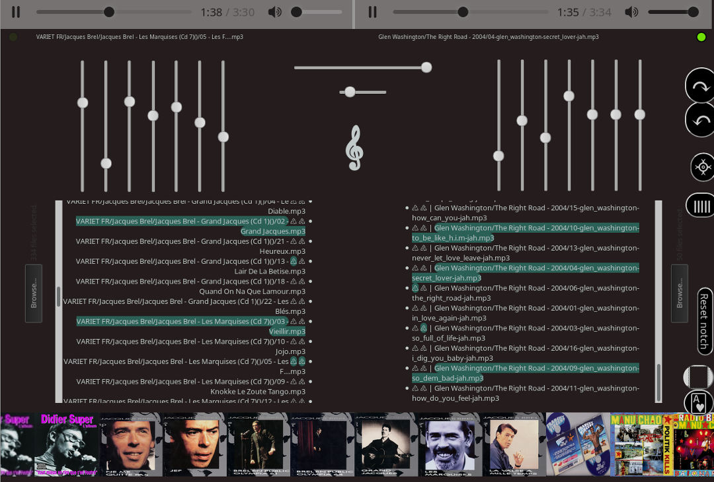

</img>

 * THOT | That HTML Orgasmic Turntable
 * Dual deck audio player
 * Crossfader with automations
 * Dual 7 bands Equalizer
 * Find songs in many local folders to organize a random playlist
 * Full keyboard controls
 * Instant song lyrics
 * Display albums pictures
 * Song notifications
 * Automixer, autoplaylists
 ***
 *  Nico KraZhtest | 2017 | ponyhacks.com
 ***
 * Keyboard events (Azerty):
 *
 * Space bar: Play random track immediatly
 *
 * [Ctrl+Enter]:  Open deckA file manager 
 * [Shift+Enter]: Open deckB file manager
 *
 * [,]: Random track on both decks
 * [;]: Random Track deck A 
 * [:]: Random Track deck B
 * [!]: Copy deckA track to deckB
 *
 * [a/z]: Slider track automations with delays
 *
 * [Ctrl+!]:  Copy deckA track to deckB
 * [Shift+!]: Copy deckB track to deckA
 *
 * [Ctrl+Left/Right]: Main Slider left/right 
 * [Alt+Up/Down]:     Main Slider switch
 * [Ctrl+Up/Down]:    Ratio slider up/down 
 * [Alt+Up/Down]:     Ratio slider switch
 *
 ***
 * Basic usage from js:
 * 
 * Random track from playlist:
 * trackRandom()
 * trackRandomA()
 * trackRandomB()
 * 
 * Play the playlist numbered 13 on deckA:
 * deckA.src = list[13]
 * 
 * Fade automation from the deck B to A in (350)ms
 * autoDeckA(350)
 * 
 * Show the Equalizer:
 * showEq("off")
 * showEq("on")
 * 
 * 
 **
